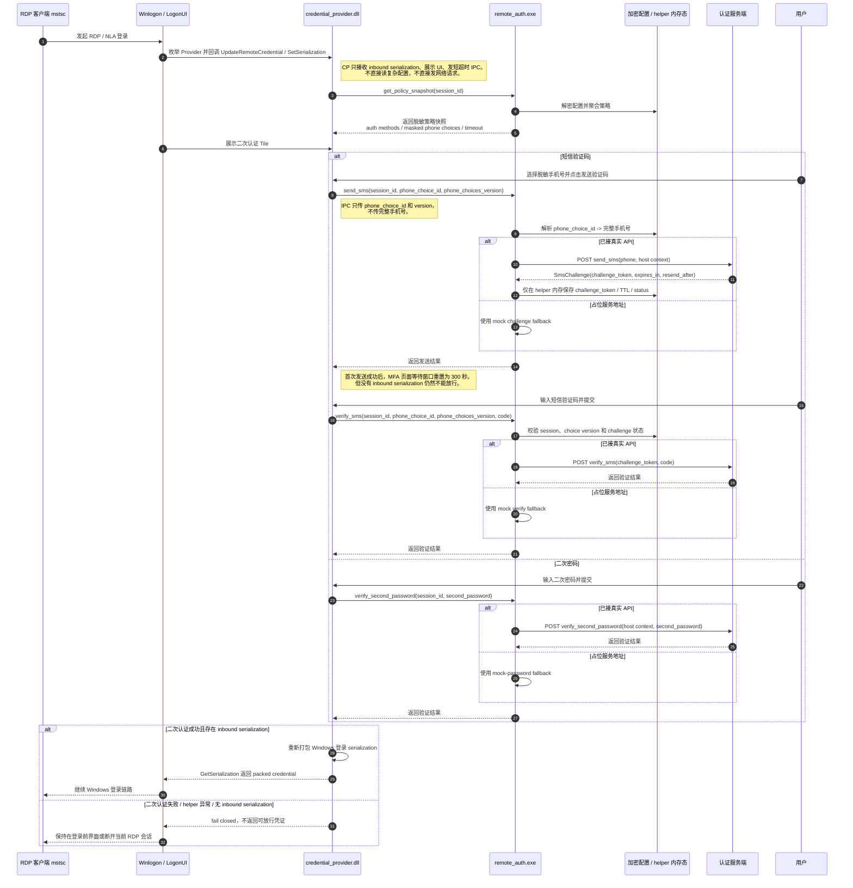

# RDP 二次认证当前主链路时序图

下图只描述当前项目已经落地或已经按当前代码结构预留好的主链路，重点反映 `credential_provider`、`remote_auth`、`auth_ipc` 和 `auth_api` 的职责边界。

## 图外约束

- `credential_provider` 只保留轻量内存态，不保存完整手机号、验证码、密码、`challenge_token` 或 serialization 内容。
- `remote_auth` 持有手机号明文映射、session 状态、challenge 状态和 API 调用逻辑；敏感值不进入 IPC、日志或错误文本。
- `phone_choice_id` 与 `phone_choices_version` 只用于 helper 内部选择和防错配，组合框中只展示脱敏手机号。
- 当前微信扫码仍是后续任务，不在这张主链路图里展示，避免把未接通逻辑画成已完成能力。
